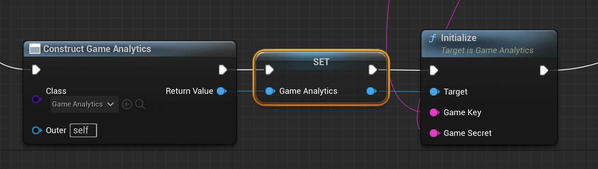

# GA-SDK-UNREAL
GameAnalytics SDK for the Unreal Engine.

Documentation can be found [here](https://docs.gameanalytics.com/integrations/sdk/unreal).  

If you have any issues or feedback regarding the SDK, please contact our friendly support team [here](https://gameanalytics.com/contact).

> :information_source:
>
> The Unreal SDK include support for **iOS**, **Android**, **HTML5**, **Windows**, **Linux** and **Mac** platforms
>
> Requirements:
> * **Unreal Engine:** 5.3+  &nbsp;
> * **iOS:** iOS 10+ &nbsp;
> * **Android:** Android API Level 21 &nbsp;
> * **Windows:** Minimum specs for UE5 &nbsp;
> * **Mac:** Minimum specs for UE5 &nbsp;

## Usage

## C++ Code

There are two ways of using the GameAnalytics plugin inside your C++ code:

- directly using an instance of an `UGameAnalytics` object
- using the `IAnalyticsProvider` interface

The former will provide all the plugin features, including remote configurations and performance tracking. The `IAnalyticsProvider` will provide an easier integration inside Unreal, but will only expose limited features.

Due to the inner workings of the module the `IAnalyticsProvider` will retrieve its settings from `Project Settings -> Plugins -> GameAnalytics`. While using `UGameAnalytics` directly will require you to manually call the setup functions (either from C++ or Blueprints).

If you are using the `IAnalyticsInterface`, but desire to enable advanced features of the SDK, you can safely mix calls from both `IAnalyticsInterface` and `UGameAnalytics` as both are using the same instance inside the module (provided you initialize the SDK only once).

### Initialization

The `UGameAnalytics` class provides all plugin functionality. The GameAnalytics module will hold an instance of `UGameAnalytics*`.

Add the headers to your project:

```c++
#include "GameAnalytics.h"
#include "GameAnalyticsModule.h"
```

Setup and initialize the SDK:

```c++
UGameAnalytics* GameAnalytics = FGameAnalyticsModule::Get().GetInstance();

// enable extra info logging
GameAnalytics->SetEnabledInfoLog(true);

// enable verbose logging -> don't forget to turn off in shipping builds
GameAnalytics->SetEnabledVerboseLog(true);

// configure available resources
GameAnalytics->ConfigureAvailableResourceItemTypes({ TEXT("copper"), TEXT("silver"), TEXT("gold") });

// initialize the SDK with your keys
GameAnalytics->Initialize(GAME_KEY, SECRET_KEY);
```

### Sending Events

After the SDK initialization you can start sending events

```c++
// send a design event
GameAnalytics->AddDesignEventWithValue(TEXT("kill:dragon"), 100);

// send a progression event
GameAnalytics->AddProgressionEvent(EGAProgressionStatus::complete, TEXT("swamplands"), TEXT("temple"), TEXT("level_0"));

// send a resource event
GameAnalytics->AddResourceEvent(EGAResourceFlowType::source, TEXT("gold"), 200, TEXT("gold_pack"), TEXT("gold_pack_large"));

// add a business event, amount needs to be in the smallest currency denominiation! (this means for USD you need to send the amount in cents)
GameAnalytics->AddBusinessEvent(TEXT("USD"), 1000, TEXT("premium_gold_bundle"), TEXT("gold_pack_5000"), TEXT("end_level_shop"));

// send an error event
GameAnalytics->AddErrorEvent(EGAErrorSeverity::warning, TEXT("error message"));

```

### Using Custom Fields

You can attach up to 50 custom fields to any event.

The following types are supported:

- boolean
- number (64-bit floating point)
- string

```c++
FGACustomFields Fields;

Fields.Set(TEXT("my_bool"), true);
Fields.Set(TEXT("my_number"), 1000.f);
fields.Set(TEXT("my_string"), FString(TEXT("halloween_event")));

GameAnalytics->AddDesignEventWithValue(TEXT("MyEvent"), 200, fields);
```

### Performance Tracker

Before initialization (e.g: calling `UGameAnlalytics::Initialize`), you can setup optional performance reporting.

```c++
// track boot-time
GameAnalytics->EnableSDKInitEvent(true);

// track hardware information (e.g: cpu name, gpu name, number of cores, memory etc)
GameAnalytics->EnableHealthHardwareInfo(true);

// track FPS
GameAnalytics->EnableFpsHistogram(true);

// track memory usage
GameAnalytics->EnableMemoryHistogram(true);
```

### Using IAnalyticsProvider

GameAnalytics also proivdes a `IAnalyticsProvider` implementation for seamless integration inside the Unreal ecosystem. 

The `IAnalyticsProvider` interface will retrieve its configuration from `Project Settings -> Plugins -> GameAnalytics` (e.g: game keys, resources, info/verbose log).

```c++

TSharedPtr<IAnalyticsProvider> AnalyticsProvider = FGameAnalyticsModule::Get().CreateAnalyticsProvider(FGameAnalyticsModule::Delegate());

// start session will invoke UGameAnalytics::Initialize on first call
AnalyticsProvider->StartSession();

// equivalent to GameAnalytics->AddDesginEvent(TEXT("my:level:id"))
AnalyticsProvider->RecordEvent(TEXT("my:level:id"), MakeAnalyticsEventAttributeArray(TEXT("value"), 100.0));

// equivalent to GameAnalytics->AddErrorEvent(EGAErrorSeverity::warning, TEXT("error message"));
AnalyticsProvider->RecordError(TEXT("error message"), MakeAnalyticsEventAttributeArray(TEXT("severity"), TEXT("warning")));

// equivalent to GameAnalytics->AddProgressionEventWithScore(EGAProgressionStatus::complete, 100, TEXT("progression1"), TEXT("progression2"), TEXT("progression3"))
AnalyticsProvider->RecordProgress(TEXT("complete"), {TEXT("progression1"), TEXT("progression2"), TEXT("progression3")}, MakeAnalyticsEventAttributeArray(TEXT("value"), 100));
```

## Blueprints

All public functions from `UGameAnalytics` are also exposed to blueprints, as well as the `IAnalyticsProvider` implementation. Anything that can be done via code is also possible using only blueprints.

Example initialization from blueprint:
